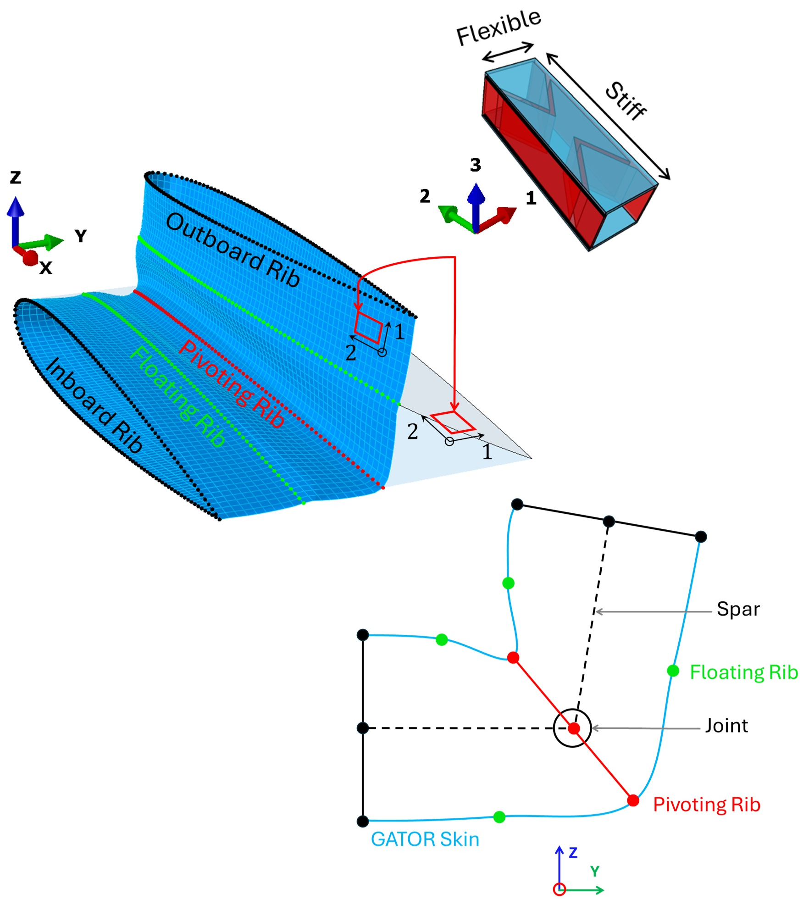

# Surrogate model for emulating nonlinear stiffness using Deep Learning

This repository contains the code for training a deep neural network to emulate the nonlinear stiffness response of a sandwich panel with a cellular core and flexible facesheets. The surrogate model is trained using data generated from solid-to-shell homogenisation of the sandwich panel unit cell under different loading conditions. The trained model can then be used to emulate the stiffness response of the sandwich panel for new loading conditions to provide the stiffness properties for the shell elements in the multiscale analysis. This approach significantly reduces the computational cost compared to running fullscale finite element simulations or multiscale finite element simulations where solid-to-shell homogenisation is done simultaneously.

## Pre-requisite
A sandwich panel with made of a cellular core and flexible facesheet has a highly nonlinear stiffness response and requires a fine mesh to compute converged FEM simulation results. This makes simulation expensive, and therefore, infeasible for design space exploration on large structures. In particular I consider an aircraft wing section with a fairing made up of the sandwich panel covering a folding wingtip joint. 

    

A computationally affordable approach to modelling this problem is to use a multiscale model where the unitcell of the sandiwch panel is modelled in high fidelity using solid elements and the geometry of the fairing is modelled using shell elements. The code for implementing this is available in GitHub Repo: [Fairing Analysis](https://github.com/nuhaadhmahid/Fairing_Analysis). 

To define the constitutive properties for the shell elements a second-order homogenisation is applied to the solid element model of the unit cell, to evaluate the following stiffness matrix.

$$ 
\begin{bmatrix} 
N_{11}\\ 
N_{22}\\ 
N_{12}\\ 
M_{11}\\ 
M_{22}\\ 
M_{12}\\ 
Q_{13}\\ 
Q_{23}
\end{bmatrix}
= \begin{bmatrix} 
A_{11}& A_{12}& A_{13}& B_{11}& B_{12}& B_{13}& 0& 0\\
A_{12}& A_{22}& A_{23}& B_{12}& B_{22}& B_{23}& 0& 0\\
A_{13}& A_{23}& A_{33}& B_{13}& B_{23}& B_{33}& 0& 0\\
B_{11}& B_{12}& B_{13}& D_{11}& D_{12}& D_{13}& 0& 0\\
B_{12}& B_{22}& B_{23}& D_{12}& D_{22}& D_{23}& 0& 0\\
B_{13}& B_{23}& B_{33}& D_{13}& D_{23}& D_{33}& 0& 0\\
0& 0& 0& 0& 0& 0& K_{11}& K_{12}\\
0& 0& 0& 0& 0& 0& K_{12}& K_{22}\\
\end{bmatrix}
\begin{bmatrix} 
\varepsilon_{11}\\ 
\varepsilon_{22}\\ 
\varepsilon_{12}\\ 
\kappa_{11}\\ 
\kappa_{22}\\ 
\kappa_{12}\\ 
\gamma_{13}\\ 
\gamma_{23}
\end{bmatrix}
$$

In the homogenisation process, the model is deformed in each of the shell deformation mode to evaluate a column of values in the shell stiffness matrix. For instance, to evaluate the first column, I set $\varepsilon_{11}=1$ and all the other deformation terms to $\varepsilon_{22}=\varepsilon_{12}=\kappa_{11}=\kappa_{22}=\kappa_{12}=\gamma_{13}=\gamma_{23}=0$. The resulting reaction load is used to evaluate the column of the stiffness matrix correspoding to $\varepsilon_{11}$ term. This process is repeated by the number of deformation modes to fully populate the stiffness matrix. The code for implimenting this process to a Kirchhof-Love plate is avaiable in GitHub Repo: [Solid-to-Shell Homogenisation](https://github.com/nuhaadhmahid/Solid_to_Shell_Homogenisation)