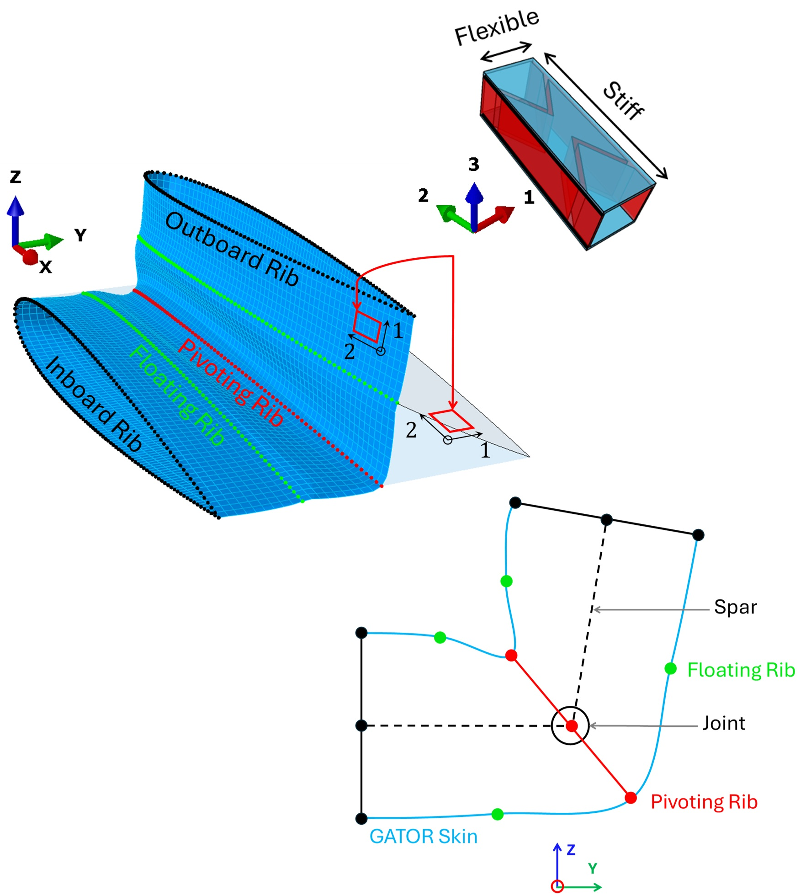

# Surrogate model for emulating nonlinear stiffness using Deep Learning

The setup below shows a wing section which has a sandwich panel skin. The sandwich panel has a highly nonlinear stiffness. Hence, it requires a fine solid mesh to compute converged FEM simulation results. This make the modelling of the wing section using solid elements (i.e., fullscale model) infeasible. Instead, wing section can be modelled using shell elements (i.e., reduced-order model) with stiffness properties updated to account for the nonlinear stiffness.

    

An approach to update stiffness is to first calculate an equivalent stiffness for the sandwich panel, called the stiffness matrix, as described in the next section. This approach could be used in two ways:

1. Homogenising a unit cell model of the sandwich panel for each shell element (i.e., $FE^2$ method), for every increment of the shell analysis. This is more expensive as the fullscale analysis, hence, infeasible for this problem.
2. Homogenising a unit cell model of the sandwich panel for various load cases and bulding a surrogate model of the stiffness matrix. This is computationally cheaper as less evaluations of the unit cell model is required to construct the dataset.

## Homogenisation
To define the stiffness properties for the shell elements a second-order homogenisation is applied to the solid element model of the unit cell, to evaluate the following stiffness matrix.

$$ 
\begin{bmatrix} 
N_{11}\\ 
N_{22}\\ 
N_{12}\\ 
M_{11}\\ 
M_{22}\\ 
M_{12}
\end{bmatrix}
= \begin{bmatrix} 
A_{11}& .& .& B_{11}& .& .\\
A_{12}& A_{22}& .& B_{12}& B_{22}& .\\
A_{13}& A_{23}& A_{33}& B_{13}& B_{23}& B_{33}\\
B_{11}& .& .& D_{11}& .& .\\
B_{12}& B_{22}& .& D_{12}& D_{22}& .\\
B_{13}& B_{23}& B_{33}& D_{13}& D_{23}& D_{33}\\
\end{bmatrix}
\begin{bmatrix} 
\varepsilon_{11}\\ 
\varepsilon_{22}\\ 
\varepsilon_{12}\\ 
\kappa_{11}\\ 
\kappa_{22}\\ 
\kappa_{12}
\end{bmatrix}
$$

In the homogenisation process, the model is deformed in each of the shell deformation mode to evaluate a column of values in the shell stiffness matrix. For instance, to evaluate the first column, let $\varepsilon_{11}=1$ and all the other deformation terms to $\varepsilon_{22}=\varepsilon_{12}=\kappa_{11}=\kappa_{22}=\kappa_{12}=0$, and run the simulation. The resulting reaction load is used to evaluate the column of the stiffness matrix correspoding to $\varepsilon_{11}$ term. This process is repeated by the number of deformation modes to fully populate the stiffness matrix. The code for implimenting this process to a Kirchhof-Love plate is avaiable in GitHub Repo: [Solid-to-Shell Homogenisation](https://github.com/nuhaadhmahid/Solid_to_Shell_Homogenisation)
