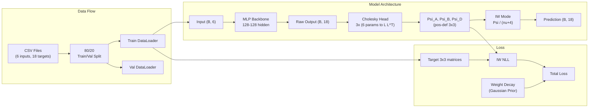

# Training Pipeline Plan

Build a training pipeline in `workspace.py` that loads deformation/stiffness data, splits it for validation, defines a neural network with an inverse Wishart output head, trains it with NLL loss + Gaussian prior, and validates the result.

The pipeline is implemented in [`workspace.py`](workspace.py), following the data-loading conventions from [`starting_point.ipynb`](starting_point.ipynb) and the model specification written in that same file. The existing [`linear_model.py`](linear_model.py) serves as a structural reference for the training loop scaffolding.

**Data summary** (from `data/x_data.csv` and `data/y_data.csv`): 1358 samples, 6 input features (strain parameters), 18 output features (unique elements of a symmetric 6x6 stiffness matrix composed of three 3x3 symmetric submatrices A, B, D).

---

## Section 1 — Data Loading

Replicate the approach from Cells 0-1 of `starting_point.ipynb`:

- Read `data/x_data.csv` and `data/y_data.csv` with pandas, convert to numpy.
- Convert to `torch.float32` tensors on the detected device (GPU if available).
- Final shapes: `x` is `(1358, 6)`, `y` is `(1358, 18)`.

## Section 2 — Held-Out Validation Split

- Use an 80/20 train/val split (consistent with the `train_split = 0.8` stub in Cell 3 of `starting_point.ipynb`).
- Wrap tensors in a `TensorDataset`, then use `torch.utils.data.random_split` with a fixed `generator` seed for reproducibility.
- Create `DataLoader`s for train (shuffled, batched) and validation (single batch).

## Section 3 — Model Definition

A `nn.Module` subclass `StiffnessNet` with:

1. **Backbone**: A small MLP mapping `(B, 6) -> (B, 18)`. Architecture: two hidden layers (e.g. 128 units each) with ReLU activations.
2. **Inverse Wishart output head** (the key piece described in the workspace instructions):
   - Split the 18 outputs into three groups of 6: raw_A, raw_B, raw_D.
   - Each group of 6 parameterises a 3x3 lower-triangular matrix L (3 diagonal + 3 strictly-lower entries).
   - Apply `softplus` to the 3 diagonal entries to guarantee positivity, then compute `Psi = L @ L^T`.
   - This gives three positive-definite 3x3 scale matrices Psi_A, Psi_B, Psi_D.
3. **MLE prediction**: The mode of the Inverse-Wishart(Psi, nu) distribution for a p x p matrix is `Psi / (nu + p + 1)`. With p = 3, the predicted stiffness submatrix is `Sigma = Psi / (nu + 4)`. `nu` is a hyperparameter (must be > 2 for p = 3); a reasonable starting value is `nu = 4` (or `nu = 5`).
4. **Output assembly**: Extract the 6 unique elements from each predicted symmetric 3x3 submatrix (matching the column order in `y_data.csv`: 11, 22, 33, 23, 13, 12), concatenate to produce `(B, 18)`.

The forward method returns both the three Psi matrices (needed for the loss) and the 18-dim prediction (needed for validation metrics).

## Section 4 — Loss Function

Two components summed together:

1. **Inverse Wishart NLL** — For each sample and each submatrix pair (Psi_i, X_i) where X_i is the target reconstructed as a 3x3 symmetric matrix (reusing `construct_sub_matrix` from `starting_point.ipynb`):

```
NLL_i = -(nu/2) * log|Psi_i| + ((nu + p + 1)/2) * log|X_i| + (1/2) * tr(Psi_i @ X_i^{-1})
```

   Sum over all three submatrices (A, B, D) and average over the batch.

   **Caveat**: The target matrices must be invertible. A and D (stiffness/bending) are expected to be positive-definite. B (coupling) has near-zero entries and may be singular or indefinite. Two options to handle this:

   - (a) Add a small diagonal jitter (`+ eps * I`) to B targets before inversion.
   - (b) Only apply IW-NLL to A and D; use MSE for B.

   **Recommended**: option (a) with `eps = 1e-4` for simplicity, matching the instructions that use IW for all three.

2. **Gaussian prior on weights** — Implemented as `weight_decay` in the **AdamW** optimiser. AdamW applies decoupled weight decay (subtracting `lr * wd * param` directly after the adaptive step), which is a more faithful implementation of a Gaussian prior than Adam's coupled L2 regularisation (where effective regularisation varies per parameter due to the adaptive second-moment scaling). A starting value of `weight_decay=1e-4` is reasonable.

## Section 5 — Training Loop

Standard PyTorch loop (structurally similar to [`linear_model.py`](linear_model.py) lines 57-74):

- Iterate over epochs (e.g. 500-1000).
- For each batch: forward pass, compute IW-NLL loss, backprop, optimiser step.
- Log training loss every N epochs.
- Optionally track validation loss each epoch for early stopping or plotting.

## Section 6 — Validation

After training:

- Set model to eval mode, disable gradients.
- Run the validation set through the model.
- Report:
  - Validation IW-NLL (same loss function).
  - Validation MSE and MAE on the full 18-dim predictions.
  - **Per-submatrix (A, B, D) error breakdown**: compute MSE and MAE separately for the A columns (indices 0-5), B columns (indices 6-11), and D columns (indices 12-17). This is important because the submatrices live on very different scales (A ~ 1-350, B ~ 1e-5, D ~ 400-4600) and aggregate metrics can mask poor performance on individual submatrices.

---

## Key Design Decisions

- **Degrees of freedom `nu`**: Treat as a fixed hyperparameter initially (`nu = 5`). Can later be made learnable.
- **Hidden layer sizes**: Start with `[128, 128]`; easy to tune later.
- **Batch size**: 64 (same as `linear_model.py`).
- **Learning rate**: `1e-4` with AdamW.
- **Gradient clipping**: `max_norm=0.5` to prevent NaN divergence from the wide scale range across submatrices.
- **Float64 loss computation**: The loss function casts to `float64` internally to avoid precision loss (B entries are ~1e-5 while D entries are ~1e3).
- **Target matrix construction**: Reuse the `construct_sub_matrix` / `construct_full_matrix` helpers from `starting_point.ipynb`, vectorised over batches.


